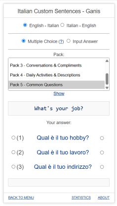

# GFlash Cards Game

Why make another flash cards?

1. No need to login or register.
2. Great for drilling. No limit, just keep going.
3. Easy to use in your PC, with 1, 2, 3 keyboard shortcut.
4. Easy to use in your phone, use your left or right thumb.

## The Design

## How to use

1. Go to https://ganiszulfa.github.io/gflash/
1. Select a group and a dataset from the dropdown menu
3. Click the Play button!
4. Select one or multiple packs.
5. Select an answer, and just wait for a few seconds before the next question.

## Advanced Use

If you want to use your own dataset, currently there's no easy way. You can either clone this and add the datasets by yourself or make a PR to this repo. You can run this in local easily, it's just a simple HTML and javascript. If there are requests for this, then I will make this easier.